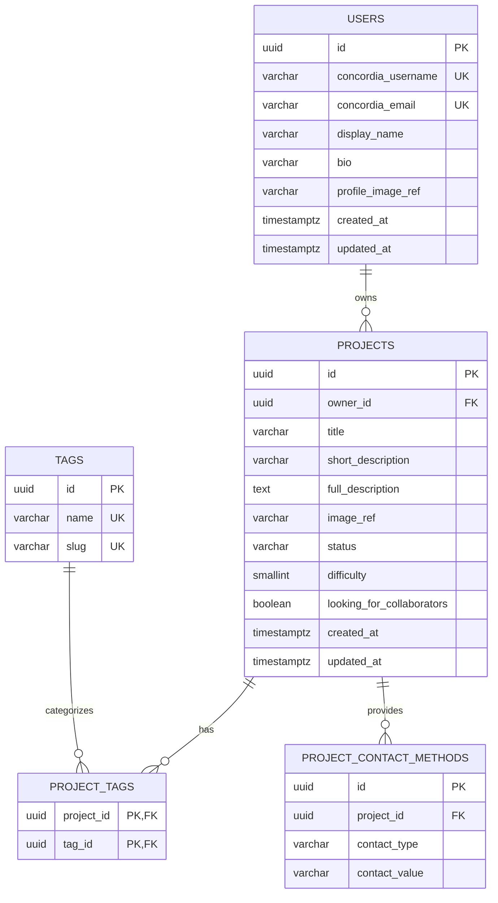

# Initial PostgreSQL Database Schema

## Design summary

- PostgreSQL database
- Plural `snake_case` table and column names
- UUID primary keys
- `timestamptz` timestamps
- `varchar` for short text and `text` for long descriptions
- `CHECK` constraints for controlled values such as project status
- Project statuses: `prototype`, `ongoing`, and `completed`

This is a schema proposal for issue #7. It does not choose an ORM or hosting
provider and does not create migrations, authentication, or a database
connection.

## Entity-relationship diagram

Diagram labels:

- `PK` — primary key: identifies one row.
- `FK` — foreign key: points to a row in another table.
- `UK` — unique key: duplicate values are not allowed. For example, two users
  cannot have the same Concordia email.

## Relationships

### Users and projects: one-to-many

One user may own many projects, but every project has exactly one owner.
`projects.owner_id` references `users.id`.

### Projects and tags: many-to-many

A project may have many tags, and a tag may belong to many projects. The
`project_tags` junction table connects them:

- `project_tags.project_id` references `projects.id`.
- `project_tags.tag_id` references `tags.id`.
- `(project_id, tag_id)` is the composite primary key, preventing the same tag
  from being added to a project twice.

### Projects and contact methods: one-to-many

A project may have several contact methods. Each contact-method row belongs to
one project through `project_contact_methods.project_id`.

### One-to-one relationships

The initial schema has no one-to-one relationship. Profile information remains
on `users` because it has the same lifecycle as the user. A separate profile
table would add complexity without meeting a current requirement.

### Postponed collaborator relationship

If the application later stores accepted collaborators, users and projects
will have a many-to-many relationship through a likely
`project_collaborators` junction table. Invitations and roles must be designed
before adding it.

## Tables

### `users`

| Column | PostgreSQL type | Required | Default | Constraints or purpose |
| --- | --- | --- | --- | --- |
| `id` | `uuid` | Yes | `gen_random_uuid()` | Primary key |
| `concordia_username` | `varchar(64)` | Yes | — | Case-insensitively unique |
| `concordia_email` | `varchar(254)` | Yes | — | Private and case-insensitively unique |
| `display_name` | `varchar(100)` | Yes | — | Public name; does not need to be unique |
| `bio` | `varchar(1000)` | No | `NULL` | Public biography |
| `profile_image_ref` | `varchar(512)` | No | `NULL` | Future image-storage reference |
| `created_at` | `timestamptz` | Yes | `now()` | Creation time |
| `updated_at` | `timestamptz` | Yes | `now()` | Last update time |

Usernames and emails should be normalized to lowercase. Unique indexes on
`lower(concordia_username)` and `lower(concordia_email)` prevent duplicates
with different capitalization.

### `projects`

| Column | PostgreSQL type | Required | Default | Constraints or purpose |
| --- | --- | --- | --- | --- |
| `id` | `uuid` | Yes | `gen_random_uuid()` | Primary key |
| `owner_id` | `uuid` | Yes | — | Foreign key to `users.id` |
| `title` | `varchar(150)` | Yes | — | Project title |
| `short_description` | `varchar(300)` | Yes | — | Summary for cards and search results |
| `full_description` | `text` | Yes | — | Detailed description; recommended 10,000-character application limit |
| `image_ref` | `varchar(512)` | No | `NULL` | Future image-storage reference |
| `status` | `varchar(20)` | Yes | `'prototype'` | `prototype`, `ongoing`, or `completed` |
| `difficulty` | `smallint` | No | `NULL` | Integer from 1 to 5; required when recruiting |
| `looking_for_collaborators` | `boolean` | Yes | `false` | Whether the project is seeking help |
| `created_at` | `timestamptz` | Yes | `now()` | Creation time |
| `updated_at` | `timestamptz` | Yes | `now()` | Last update time |

Status meanings:

- `prototype`: design or experimental stage; significant changes are possible.
- `ongoing`: active development with an established direction.
- `completed`: finished or no longer actively developed.

### `tags`

| Column | PostgreSQL type | Required | Default | Constraints or purpose |
| --- | --- | --- | --- | --- |
| `id` | `uuid` | Yes | `gen_random_uuid()` | Primary key |
| `name` | `varchar(60)` | Yes | — | Display name; case-insensitively unique |
| `slug` | `varchar(80)` | Yes | — | Unique lowercase URL-safe name |

### `project_tags`

| Column | PostgreSQL type | Required | Constraints |
| --- | --- | --- | --- |
| `project_id` | `uuid` | Yes | Foreign key to `projects.id`; `ON DELETE CASCADE` |
| `tag_id` | `uuid` | Yes | Foreign key to `tags.id`; `ON DELETE CASCADE` |

The composite primary key is `(project_id, tag_id)`. A separate ID is not
needed because this pair uniquely identifies the relationship.

### `project_contact_methods`

| Column | PostgreSQL type | Required | Default | Constraints or purpose |
| --- | --- | --- | --- | --- |
| `id` | `uuid` | Yes | `gen_random_uuid()` | Primary key |
| `project_id` | `uuid` | Yes | — | Foreign key to `projects.id` |
| `contact_type` | `varchar(32)` | Yes | — | `concordia_email`, `discord`, `instagram`, or `external_link` |
| `contact_value` | `varchar(2048)` | Yes | — | Opt-in address, handle, or validated URL |

The unique combination `(project_id, contact_type, contact_value)` prevents an
identical method from being added to one project twice.

## Deletion behavior

| Relationship | Behavior | Reason |
| --- | --- | --- |
| User to owned projects | `ON DELETE RESTRICT` | Prevent accidental deletion of a user's projects |
| Project to tag assignments | `ON DELETE CASCADE` | Assignments have no purpose without the project |
| Tag to tag assignments | `ON DELETE CASCADE` | Removing a tag removes its assignments, not projects |
| Project to contact methods | `ON DELETE CASCADE` | Contact rows have no purpose without the project |

## Important constraints and indexes

- Case-insensitive unique indexes for username, email, and tag name
- Unique tag slug
- Project-status check allowing only the three approved statuses
- Difficulty check allowing `NULL` or an integer from 1 through 5
- Project check requiring a difficulty when recruiting
- Composite primary key on `project_tags`
- Contact-type check allowing only approved types
- Foreign-key indexes on `projects.owner_id`, `project_tags.tag_id`, and
  `project_contact_methods.project_id`

## Collaboration contact rule

When `looking_for_collaborators` is true, a project must have a difficulty and
at least one contact method.

PostgreSQL can check the difficulty directly because it is on the project row.
A normal `CHECK` constraint cannot verify that a related contact row exists.
The application should therefore save the project and its contact methods in
one transaction and reject changes that would leave a recruiting project with
no contact method. A deferred database trigger can be considered later if
database-level enforcement becomes necessary.

## Frontend mapping

The current TypeScript `Project` interface is designed for displaying mock
data, not for storing relational data directly.

| Frontend field | Database source or decision |
| --- | --- |
| `id`, `title` | `projects.id`, `projects.title` |
| `description` | `short_description` on cards; `full_description` on detail pages |
| `image` | URL later derived from `projects.image_ref` |
| `creator` | `users.display_name`, joined through `owner_id` |
| `collaborators` | Postponed until membership is designed |
| `tags` | Joined through `project_tags` |
| `projectStatus` | `projects.status` |
| `difficulty` | `projects.difficulty` |
| `isSeekingCollaborators` | `projects.looking_for_collaborators` |
| `contactMethods` | Rows from `project_contact_methods` |
| `createdAt` | `projects.created_at` |

## Privacy and validation

- A user's Concordia email is private by default.
- An authentication email must not automatically become a public contact.
- Contact methods require the project owner's explicit consent.
- Contact values and links must be validated before storage and display.
- Only the project owner or an authorized administrator may edit a project's
  contact methods.
- Examples and tests must use fictional identities and no credentials.

## Postponed decisions

1. PostgreSQL hosting provider and version
2. ORM and migration tool
3. Authentication, eligible Concordia domains, and session storage
4. Account deletion, project transfer, archival, or anonymization
5. Image-storage provider and the exact meaning of an image reference
6. Collaborator invitations, roles, and acceptance
7. Stored formats for collaboration needs and availability
8. Contact visibility rules
9. Whether the application or a trigger maintains `updated_at`
10. Whether cross-table contact enforcement eventually needs a deferred trigger

After these choices are reviewed, a separate implementation issue can convert
the approved design into migrations and constraint tests.
